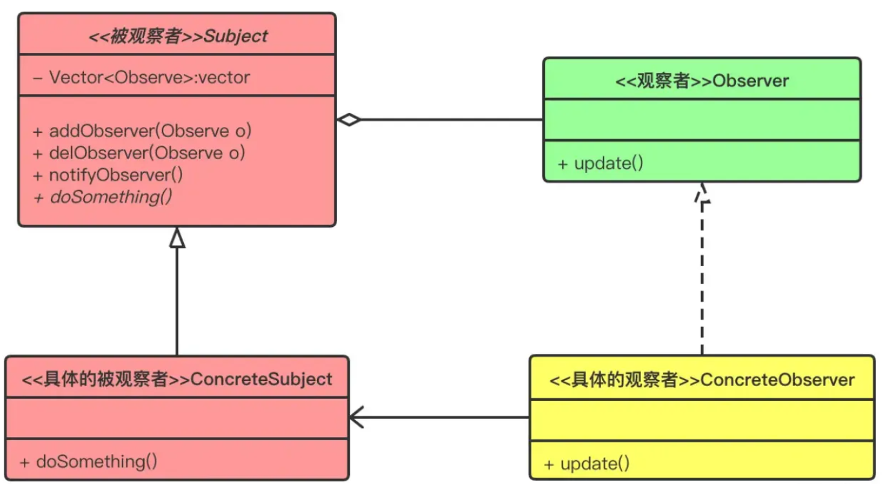

# 观察者模式

为了能在股市中获利，股民们时刻关注着股市的风吹草动，其正类似于捉摸不定的数据对象状态。但是大部分是无用功，倒不如股票的价格发生变动的时候主动的通知股民。

再或者，由于 HTTP 无状态连接协议的特性，服务端无法主动推送（Push）消息给 Web 客户端，因此我们常常会用到轮询策略，也就是持续轮番询问服务端状态有无更新。然而当访问高峰期来临时，成千上万的客户端（观察者）轮询会让服务端（被观察者）不堪重负。

观察者模式 Obserser Pattern）定义了一种一对多的依赖关系，让多个观察者对象同时监听并收到被观察对象的状态变化通知。在观察者模式中，主题（Subject）维护一个观察者（Observer）列表，并在状态发生变化时通知观察者。

观察者模式的类图如下：

在观察者模式中，主要包含以下几个角色：

- Subject（目标）：被观察者，它是指被观察的对象。 从类图中可以看到，类中有一个用来存放观察者对象的 Vector 容器（之所以使用 Vector 而不使用 List，是因为多线程操作时，Vector 在是安全的，而 List 则是不安全的），这个 Vector 容器是被观察者类的核心，另外还有三个方法：attach 方法是向这个容器中添加观察者对象；detach 方法是从容器中移除观察者对象；notify 方法是依次调用观察者对象的对应方法。这个角色可以是接口，也可以是抽象类或者具体的类，因为很多情况下会与其他的模式混用，所以使用抽象类的情况比较多；
- ConcreteSubject（具体目标）：具体目标是目标类的子类，通常它包含经常发生改变的数据，当它的状态发生改变时，向它的各个观察者发出通知。同时它还实现了在目标类中定义的抽象业务逻辑方法（如果有的话）。如果无须扩展目标类，则具体目标类可以省略；
- Observer（观察者）：观察者将对观察目标的改变做出反应，观察者一般定义为接口，该接口声明了更新数据的方法 update()，因此又称为抽象观察者；
- ConcreteObserver（具体观察者）：在具体观察者中维护一个指向具体目标对象的引用，它存储具体观察者的有关状态，这些状态需要和具体目标的状态保持一致；它实现了在抽象观察者 Observer 中定义的 update()方法。通常在实现时，可以调用具体目标类的 attach() 方法将自己添加到目标类的集合中或通过 detach() 方法将自己从目标类的集合中删除。
